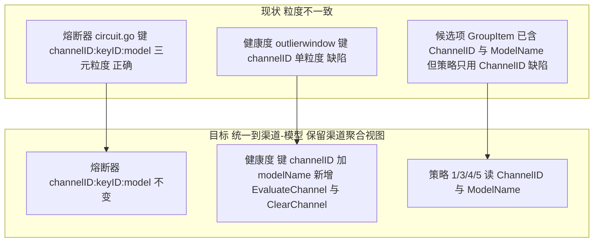

# 渠道-模型健康度与轮询策略优化设计

日期：2026-08-20
范围：`internal/relay/balancer/`、`internal/outlierwindow/`、`internal/relay/`（错误分类与上报点）、`internal/task/site_outlier.go`（消费方兼容）
背景：`docs/omni-routing-strategy-report-20260812.md` §8/§9 已完成 A 类策略移植（新增模式 5/6/7/8）。本文解决移植后暴露的缺陷。

---

## 1. 问题陈述（均已在代码与生产日志中核实）

| 编号 | 问题 | 证据 |
|---|---|---|
| P1 | RoundRobin 用全局单计数器，且与 HealthFirst 同档轮换共用同一计数器 | `balancer.go:14` `var roundRobinCounter uint64`；`balancer.go:55`、`health_order.go:79` 同时 `atomic.AddUint64(&roundRobinCounter,1)` |
| P2 | Failover 无健康感知，纯 Priority 排序，坏渠道只要 Priority 最小就一直排第一 | `balancer.go:82-87` 仅 `sortByPriority` |
| P3 | Weighted 权重公式数学错误，排序概率不等于权重比例 | `balancer.go:122` `score = rand.Float64()*float64(w)/float64(totalWeight)` |
| P4 | 健康度按 channelID 聚合，一个模型出错拖累整渠道；同时大量真实错误未计入健康度 | `outlierwindow/window.go:56` `store` key 为 `int(channelID)`；`relay_handler.go:203` 过滤掉 `Written`/`Canceled`/`ResetConversation` |
| P5 | HealthFirst 注释声称「且非熔断」，实际从未调用 `IsTripped` | `health_order.go:22` 注释 vs `health_order.go:38-90` 无熔断调用 |

### P3 的数学说明

现公式：`score_i = U_i * w_i / W`，其中 `U_i ~ Uniform(0,1)`，`W = Σw`。
`W` 对所有 i 相同，是常数因子，对降序排序完全无影响，等价于 `score_i = U_i * w_i`。

`U*w` 降序确实偏向大权重，但偏向的量不等于权重比。以 `w = {2, 1}` 为例：
`P(2*U_1 > U_2) = 1 - P(U_2 > 2*U_1) = 1 - ∫₀^0.5 (1-2u) du = 1 - 0.25 = 0.75`
期望应为 `2/3 ≈ 0.667`，实际 0.75，系统性放大高权重项。权重差越大偏差越大（`w={10,1}` 时首位概率 0.95 而非 0.909）。

正解：Efraimidis-Spirakis 加权无放回抽样，`key_i = U_i^(1/w_i)` 降序，等价于 `key_i = -ln(U_i)/w_i` 升序。该方法保证每个前缀位置的边缘概率恰好等于剩余权重比例。数值上取 `-ln(U)/w` 升序更稳定（避免 `w` 大时 `U^(1/w)` 全部趋近 1 造成浮点分辨率丢失）。

---

## 2. 三层粒度现状与目标



三层职责边界（不重叠）：

| 层 | 键 | 时间尺度 | 作用 | 谁写 | 谁读 |
|---|---|---|---|---|---|
| 熔断器 `circuit.go` | `channel:key:model` | 秒级，硬开关 | 达到连续硬失败阈值直接拒绝该三元组，指数退避冷却 60s→600s | 全部 relay 路径 | `iterator.go` 选路跳过；HealthFirst 排序降档 |
| 健康度 `outlierwindow` | `channel:model`（改造后） | 10 分钟滚动窗口，软信号 | 提供 0~1 连续分，用于排序偏好，不做拒绝 | 全部 8 策略路径 | 仅 HealthFirst 选路读；POR 读聚合视图 |
| POR 被动离群退役 `task/site_outlier.go` | `channelID` | 分钟级，运维动作 | 门1 用渠道聚合失败率筛候选，经门2/门3 探活后禁用渠道 | — | `EvaluateChannel` |

约束：`outlierwindow` 包零依赖 `internal/op`（阈值由 task 侧 `Configure` 注入，见 `window.go:1-9` 包注释），改造必须维持，否则产生 `op → task → outlierwindow → op` 循环依赖。

---

## 3. 健康度计算：公式、标准、范围

### 3.1 数据来源：滚动成败窗口

`outlierwindow.ringWindow` 是每键一个的定长环形缓冲：

- 物理容量 `physicalCap = 20`（`window.go:22`，编译期常量，`Config.Capacity` 不得超过它）。
- 每次 relay 结束（成功或失败）调用 `Report(key, success, statusCode, now)` 写入一条 `sample{success, at}`。
- `Evaluate(key, now)` 只统计 `now - sample.at <= TimeWindow` 的样本，超窗样本视为不存在（惰性过期；整键回收由 `Reap(now, ttl)` 负责）。

默认阈值（`window.go:47-53` `defaultConfig`，可被 task 侧 `Configure` 覆盖）：

| 参数 | 默认 | 含义 |
|---|---|---|
| `Capacity` | 20 | 每键最多保留的样本数 |
| `TimeWindow` | 10 min | 样本有效期 |
| `MinSamples` | 8 | 低于此值不作离群判定（POR 门1） |
| `FailRate` | 0.85 | POR 门1 的失败率阈值 |
| `ConsecFails` | 10 | POR 门1 的连续失败阈值 |

`Evaluate` 输出 `WindowStats{Samples, Failures, FailureRate, ConsecutiveFails, LastSuccessAt, LastSampleAt, Candidate}`（`window.go:125-133`）。

### 3.2 健康分公式

`balancer.channelHealthScore`（改造后重命名 `itemHealthScore(channelID int, modelName string, now time.Time) float64`）：

```text
st = Evaluate(channelID, modelName, now)

if st.Samples == 0:
    return 0.5                                        # 冷启动中性

score = 1 - st.FailureRate                            # 基础：成功率
score = score - min(0.1 * st.ConsecutiveFails, 0.5)   # 连续失败惩罚，最多扣 0.5
score = max(score, 0)

if st.Samples < 8:                                    # minHealthSamples，与 MinSamples 对齐
    score = (score + 0.5) / 2                         # 证据不足，向中性回拉一半

return score
```

取值范围 `[0, 1]`，越大越健康。三条设计意图：

1. 成功率是主项：`1 - FailureRate` 直接反映窗口内成败比例。
2. 连续失败是加速项：同样 50% 失败率，「交替失败」与「连续 5 次失败」风险不同，后者更可能是持续性故障。每条连续失败扣 0.1，上限 0.5 —— 上限避免连续失败单独把分打到 0，保留与失败率的相对可比性。
3. 冷启动与小样本保守：`Samples == 0` 给 0.5 而非 1.0，避免「完全未知」击败「已知良好」（0.9）；`Samples < 8` 时向 0.5 回拉一半，1 次失败（`score=0`）只降到 0.25 而不是 0，避免单次抖动直接把渠道-模型打入冷宫。

### 3.3 档位边界与语义

`health_order.go:21-25`：

| 档位 | 常量 | 分数范围 | 语义 | 典型窗口状态 |
|---|---|---|---|---|
| Good | `healthTierGood = 0` | `score >= 0.6` | 优先使用 | 失败率 <= 40% 且无长连续失败 |
| Degraded | `healthTierDeg = 1` | `0.3 <= score < 0.6` | 降级备选 | 失败率 40%~70%，或小样本已见失败 |
| Bad | `healthTierBad = 2` | `score < 0.3` | 最后兜底（不移除） | 失败率 > 70%，或连续失败 >= 3 |

为什么分档而不是直接按连续分排序：连续分排序会让 0.92 与 0.89 之间的微小噪声决定全部流量走向，形成赢家通吃和抖动。分档加档内轮换让同档候选均摊流量，只在档间做硬偏好。这与 Envoy outlier detection、gRPC 的通用做法一致（离群检测负责剔除，负载均衡在健康集合内均摊）。

边界值来由：`score = 0.6` 对应「失败率 40%、无连续失败」；`score = 0.3` 对应「失败率 70%」或「失败率 50% 且连续失败 2 次」。即 Good 要求多数请求成功，Bad 意味着多数请求失败。

### 3.4 熔断状态如何进入健康排序

熔断是硬开关，不混入连续分（否则被回拉、被平均，失去硬性）。做法是档位覆盖：

```text
tier = tierOf(score)
if 该 (channel, model) 的可用 Key 全部处于熔断打开态:
    tier = healthTierBad          # 压到最低档，但不从候选中删除
```

保留在候选中的原因：`iterator.go` 才是真正做「跳过」决策的地方，balancer 只负责排序。若在此删除，会出现「全部候选都熔断 → 候选集为空 → 请求直接 500」，而不是走到迭代器的降级路径。

实现约束：`circuit.IsTripped` 有副作用（`circuit.go:104-150`：Open 冷却到期自动迁移 HalfOpen；HalfOpen 探测超时迁回 Open；HalfOpen 下返回 true 以拒绝并发探测）。在排序热路径调用它会（a）意外消耗半开探测配额，（b）让排序结果依赖调用顺序。因此新增只读函数：

```go
// PeekItemTripped 只读查询熔断状态，不做任何状态迁移，供排序等旁路场景使用。
// 排序阶段没有 keyID，按 "channelID:" 前缀 + ":modelName" 后缀匹配该渠道-模型的全部 Key，
// 任一 Key 处于熔断打开且仍在冷却窗内即视为 tripped。
func PeekItemTripped(channelID int, modelName string) bool
```

---

## 4. 错误作用域三分类

### 4.1 现状缺口

两条判定链：

- `retry.go:12-20`：`isRetryableStatus(code) = code==0 || code==429 || code>=500`；`isPassthroughStatus(code) = code==429 || code==503`。
- `relay_attempt.go:13-18` `circuitFailureKind`：`retryEnabled && isPassthroughStatus` → `FailureSoftRateLimit`，否则 `FailureHard`。

两条链只看 HTTP 状态码，而上游返回的状态码与真实语义大量不一致。以下为 fwq57ys 生产容器 `octopus`（image `v0.10.2-mumu.19`）48 小时日志实测：

状态码分布：`403:1056 503:865 400:388 429:319 500:314 401:220 524:147 405:130 402:120 502:82 504:39 422:36 404:28 530:19 522:3 410:2 525:1 520:1`

| 上游报文样本 | HTTP | 现判定 | 应有作用域 | 理由 |
|---|---|---|---|---|
| `用户额度不足, 剩余额度: ¥0.000000` / `insufficient_user_quota` | 403 | Hard，不可重试 | Channel | 账号余额耗尽，该渠道所有模型都不可用 |
| `Invalid token` / `new_api_error` | 401 | Hard | Channel | 凭据失效，与模型无关 |
| `No available channel for model gpt-5.6-sol under group` / `model_not_found` | 503 | Soft（不累计） | Model | 上游侧没有这个模型，其他模型正常 |
| `当前模型 gpt-5.6-sol 负载已经达到上限` / `get_channel_failed` | 500 | Hard | Model + Soft | 语义是单模型限流，不该按 500 当硬故障累计 |
| `No available accounts` | 503 | Soft | Channel | 上游账号池空 |
| 裸 `<html>` 响应体 | 405 | Hard | Channel | 端点/路径配置错误 |
| Cloudflare 拦截页（160 次） | 5xx / 403 | 视码而定 | Channel | 网络层拦截，全渠道受影响 |
| `stream error from channel X`（2487 次） | — | 完全漏判 | Model | 被 `Written` 过滤掉，见 4.3 |
| `connection reset by peer`（321 次） | — | 可能漏判 | Channel | 传输层故障 |
| `failed to send request: Post ...`（323 次） | 0 | Hard，可重试 | Channel | 判定正确，保持 |
| 客户端 `validate_thinking_parts_role` 类（29228 次） | 400 | Hard | Ignore | 客户端请求体不合法，与上游健康无关，计入会严重污染健康度 |

29228 次客户端 400 与 2487 次流中断的对比说明当前健康度的实际信噪比：该计入的没计入，不该计入的全计入了。

### 4.2 三分类定义

```go
// internal/relay/failure_scope.go，仅 relay 包内使用故不导出
type failureScope int

const (
    scopeIgnore  failureScope = iota // 不写入任何健康度
    scopeModel                       // 只写入 (channelID, modelName)
    scopeChannel                     // 写入该渠道下所有已知 model 键
)
```

| 作用域 | 判定依据 | 写入范围 |
|---|---|---|
| `scopeIgnore` | 客户端错误（请求体校验失败、参数非法、`Canceled` 客户端主动断开）、鉴权发生在 octopus 自身而非上游 | 不写 |
| `scopeModel` | `model_not_found`、单模型负载上限、上游 context 超限、单模型 4xx、流中断 | 仅 `(channel, model)` |
| `scopeChannel` | 额度与计费（`insufficient_user_quota`、`insufficient_quota`、402）、凭据（401 `Invalid token`）、账号池空（`no available account`）、连接层失败（`code==0`、`reset by peer`、`failed to send request`）、Cloudflare 或 HTML 拦截页、5xx | 该渠道全部 model 键 |

复用已有语义识别函数（`relay/ws_error.go`，无需重写）：

| 函数 | 行 | 映射作用域 |
|---|---|---|
| `isUpstreamQuotaError` | 175-179 | Channel |
| `isNoAvailableAccountError` | 153-155 | Channel |
| `isUpstreamRateLimitError` | 161-167 | Model + Soft |
| `isUpstreamContextLimitError` | 169-173 | Model |
| `isBlockedInvalidRequestError` | 157-159 | Ignore（客户端触发的内容拦截） |
| `needsConversationRestart` | 145-151 | Model |

需新增识别（当前完全未覆盖）：`insufficient_user_quota`（含中文「用户额度不足」）、`model_not_found`、`get_channel_failed`（「负载已经达到上限」）、`Invalid token`、Cloudflare 拦截页特征、裸 HTML 响应体。

scopeChannel 的写入实现：不引入渠道级独立键（那会重新制造两套粒度）。做法是遍历 `store` 中该 channelID 的现存子键逐个 `Report(false)`；若该渠道当前无任何子键（进程刚启动），至少写入本次请求的 `(channel, model)`，后续请求自然铺开子键。这样保证渠道级故障最终污染全部模型，同时不新增数据结构。

### 4.3 上报点漏判修复

`relay_handler.go:203` 现状：

```go
if !result.Success && !result.Written && !result.Canceled && !result.ResetConversation {
    outlierwindow.Report(channel.ID, false, result.StatusCode, now)
}
```

三个过滤条件的正确处理：

| 标志 | 现状 | 应有 | 理由 |
|---|---|---|---|
| `Written` | 跳过 | 必须计入（`scopeModel`） | 已开始向客户端写响应后上游流中断，是上游故障的强信号（生产 2487 次） |
| `ResetConversation` | 跳过 | 计入（`scopeModel`） | 上游要求重建会话，属上游异常 |
| `Canceled` | 跳过 | 保持跳过（`scopeIgnore`） | 客户端主动断开，与上游健康无关（生产 145 次） |

`images.go:239` 的 `if written { return }` 同样修复。

### 4.4 八个上报点改造清单

| 文件:行 | 成/败 | model 来源 |
|---|---|---|
| `relay/relay_handler.go:206` | false | `plan.UpstreamModel()`（同函数 205 行已用） |
| `relay/relay_handler.go:261` | true | `handleSuccessfulAttempt` 内，当前签名不含 plan，需加参数（调用点 213 行，plan 在作用域内） |
| `relay/compact.go:186` | true | `requestModel`（184 行已用） |
| `relay/compact.go:194` | false | `requestModel`（193 行已用） |
| `relay/images.go:212` | true | `item.ModelName`（225 行已用） |
| `relay/images.go:259` | false | `item.ModelName` |
| `relay/ws_client.go:586` | false | `item.ModelName`（WS relay 循环内候选项） |
| `relay/ws_client.go:598` | true | `item.ModelName` |

`images.go` 另有一处漏判已在本次补齐：`if written {}` 分支原先直接 `return true`，
失败样本从不落库；现在 `:240` 先 `reportOutlierFailure` 再返回。

**WS 预热路径不写健康度**（有意取舍）：`bestEffortWarmupUpstreamWS`（`ws_client.go:302-380`）
只调 `warmupUpstreamWSConnection` → `TryUpstreamWS` 把连接建好放进池（`:401-407`），
全程不发任何模型请求，没有 statusCode、没有上游 body，没有「这个模型是否可用」的证据。
把建连失败算成模型失败会污染窗口（连不上通常是渠道/网络问题，且没有真实请求做参照），
因此预热失败只靠 `iter.SkipCircuitBreak` 与熔断器保护，不进 outlierwindow。

---

## 5. 写入与读取矩阵

原则（用户明确要求）：8 种策略的 relay 路径全部写入渠道-模型健康度；只有 HealthFirst 在选路时读取它。

写入发生在 relay 完成阶段（上述 8 个点），与选路策略无关 —— 所以「全部写入」天然成立，不需要按策略分支。

| # | 模式 | 写健康度 | 选路读健康度 | 选路读熔断 | 备注 |
|---|---|---|---|---|---|
| 1 | RoundRobin | 是 | 否 | 否（迭代器仍跳过） | 本次改造：按候选集合分桶计数器 |
| 2 | Random | 是 | 否 | 否 | 不改 |
| 3 | Failover | 是 | 是（同 Priority 内二次排序） | 是 | 本次改造 |
| 4 | Weighted | 是 | 否 | 否 | 本次改造：只修公式，不加健康度 |
| 5 | HealthFirst | 是 | 是（主序） | 是 | 本次改造：模型级、熔断降档、独立轮换计数器 |
| 6 | LeastUsed | 是 | 否 | 否 | 不改 |
| 7 | P2C | 是 | 否 | 否 | 不改 |
| 8 | StrictRandom | 是 | 否 | 否 | 不改 |

Failover 读健康度不打破 Priority 主序：Priority 是运维显式表达的主备意图，健康度只在同 Priority 的平级候选之间决定先后。与 HealthFirst 的区别是：HealthFirst 允许健康度跨越 Priority（tier 是第一排序键，Priority 是第三）。

Weighted 保持不读健康度：用户选 Weighted 就是要按配置比例分流（成本或配额分摊），混入健康度会让实际比例偏离配置，健康偏好应由 HealthFirst 承担。

---

## 6. 策略 1/3/4/5 改造前后对比

### 策略 1 RoundRobin

| | 现状 | 改造后 |
|---|---|---|
| 计数器 | `roundRobinCounter` 全局单个 | 按候选集合指纹分桶：`sync.Map[fingerprint]*uint64` |
| 后果 | 分组 A 的请求推进了分组 B 的游标；HealthFirst 的同档轮换也在推进同一游标，两者互相踩踏，轮询退化为伪随机 | 各候选集合独立轮转，真正均匀轮询 |

`Balancer` 接口 `Candidates(items []model.GroupItem)` 不携带 groupID（`balancer.go:20`），只能用候选集合指纹作桶键 —— 与 StrictRandom 的 `strictDeckKey`（`strict_random.go:31-44`）同一手法。注意现有 `strictDeckKey` 只拼 `ChannelID`，同一渠道下不同模型集合会撞桶，本次需扩展为 `ChannelID:ModelName` 拼串，并让 RoundRobin 复用同一指纹函数。

### 策略 3 Failover

| | 现状 | 改造后 |
|---|---|---|
| 排序键 | `Priority` 升序（单键） | `Priority` 升序 → 熔断态（未熔断优先）→ 健康分降序 |
| 后果 | Priority=0 的渠道-模型即使 100% 失败仍固定排第一，每次请求先撞墙再重试，浪费一整个 RTT 与重试预算 | 主备意图保留，平级内自动避开坏项 |

实现用 `sort.SliceStable`，保证同 Priority 同健康度时输入顺序稳定（可复现）。

### 策略 4 Weighted

| | 现状 | 改造后 |
|---|---|---|
| 公式 | `score = U * w / W` 降序 | `key = -ln(U) / w` 升序（Efraimidis-Spirakis） |
| 首位边缘概率 `w={2,1}` | 0.75（应为 0.667） | 0.667 |
| 首位边缘概率 `w={10,1}` | 0.95（应为 0.909） | 0.909 |

边界处理：`w <= 0` 归一为 1（沿用现状）；Go 的 `rand.Float64()` 返回 `[0,1)`，可能返回 0 导致 `-ln(0) = +Inf`，实现用 `1 - rand.Float64()` 取 `(0,1]`。

### 策略 5 HealthFirst

| | 现状 | 改造后 |
|---|---|---|
| 健康度粒度 | `channelHealthScore(item.ChannelID)` | `itemHealthScore(item.ChannelID, item.ModelName)` |
| 熔断感知 | 注释声称有，代码无（P5） | `PeekItemTripped` 只读查询，熔断项 tier 压到 Bad |
| 同档轮换计数器 | 与 RoundRobin 共用 `roundRobinCounter`（P1） | 独立的按候选集合分桶计数器 |
| 排序键 | tier 升序 → score 降序 → Priority 升序 | 不变 |

---

## 7. outlierwindow 键升级与消费方兼容

### 7.1 键结构

```go
// 改造前：var store sync.Map  // int(channelID) -> *ringWindow
// 改造后：
type windowKey struct {
    ChannelID int
    Model     string
}
var store sync.Map // windowKey -> *ringWindow
```

用结构体作 `sync.Map` 键（可比较类型，合法）而非拼接字符串，避免模型名含 `:` 时的歧义与每次查询的字符串分配。

### 7.2 必须新增的聚合 API

`internal/task/site_outlier.go`（POR 被动离群退役）有 8 处按 channelID 消费，若只改键不加聚合 API，POR 会全线失效：

| 行 | 调用 | 改为 |
|---|---|---|
| `:46` | `Configure(cfg.window)` | 不变 |
| `:79` | `Evaluate(b.ChannelID, now)` | `EvaluateChannel(b.ChannelID, now)` |
| `:108` | `Reap(now, cfg.reapTTL)` | 不变（内部按 windowKey 遍历） |
| `:148` | `Clear(st.ChannelID)` | `ClearChannel(st.ChannelID)` |
| `:169` | `Clear(channelID)` | `ClearChannel(channelID)` |
| `:226` | `Clear(sib)` | `ClearChannel(sib)` |
| `:256` | `Evaluate(chID, now)` | `EvaluateChannel(chID, now)` |
| `:294` | `Evaluate(sib, now).Candidate` | `EvaluateChannel(sib, now).Candidate` |

`EvaluateChannel` 聚合语义（POR 判定渠道整体是否该退役，需要合并所有模型的样本）：

```text
遍历 store 中 ChannelID 匹配的全部子键：
  Samples          = Σ 子键 Samples
  Failures         = Σ 子键 Failures
  FailureRate      = Failures / Samples          (Samples==0 时为 0)
  ConsecutiveFails = max(子键 ConsecutiveFails)   取最大而非求和
  LastSuccessAt    = max(子键 LastSuccessAt)
  LastSampleAt     = max(子键 LastSampleAt)
  Candidate        = 用聚合值重新跑门1三档判定
```

`ConsecutiveFails` 取 max 的理由：连续失败是同一键上的连续性属性，跨键求和没有物理意义（两个模型各连续失败 5 次不等于渠道连续失败 10 次）；取 max 表达「该渠道下最坏的那个模型已连续失败多少次」，对 POR 的探活决策是正确的保守方向。

其它测试消费方（需同步）：`internal/task/site_outlier_test.go`（`:115` Report、多处 Configure）、`internal/relay/images_limits_test.go`（`:137/239/298` Clear，`:157/276/320` Evaluate 断言 `Samples != 0`）、`internal/relay/balancer/health_order_test.go`（`:18/21` Report）。

### 7.3 内存上限

改造后键数量从 `O(渠道数)` 变为 `O(渠道数 × 该渠道活跃模型数)`。单键内存约 500 B（20 条 sample 加 mutex 与元数据）。按 100 渠道 × 20 活跃模型估算约 1 MB，可接受。已有的 `Reap(now, ttl)`（`window.go:216-238`，持锁复检删除防 TOCTOU）负责回收 `lastSeen` 超 ttl 的键，模型下线后自动清理，无需新增淘汰机制。

---

## 8. 验证计划

构建与回归：

```bash
go build ./...
go test ./internal/relay/balancer/... ./internal/outlierwindow/... ./internal/task/... ./internal/relay/...
```

新增测试（每条对应一个缺陷，且覆盖失败路径）。实际落地 28 个新测试，分布在四个文件：

`internal/outlierwindow/window_test.go`（渠道-模型键与聚合语义）：

| 测试 | 断言 | 对应缺陷 |
|---|---|---|
| `TestModelIsolation` | `(ch, m1)` 连续 10 次失败后 `Evaluate(ch, "m2").Samples == 0` | P4 核心 |
| `TestReportChannelFansOutToAllModels` | `ReportChannel` 后本渠道全部已知 model 子键各加 1 样本，邻近渠道不受污染 | 4.2 |
| `TestReportChannelBootstrapsWhenNoSubKey` | 本次请求的 `(channelID, modelName)` 无条件写入（哪怕该渠道此前没有任何子键），不新增渠道级独立键 | 4.2 |
| `TestEvaluateChannelAggregatesModels` | 两模型各 4 样本时 `Samples==8`、`Failures==5`、`ConsecutiveFails` 取 max(3) 而非 sum(5) | 7.2 |
| `TestEvaluateChannelEmpty` | 无数据返回零值且非候选 | 7.2 |
| `TestClearChannelRemovesAllModels` | `ClearChannel` 清空本渠道全部模型子键，不越界清邻近渠道 | 7.2 |

`internal/relay/failure_scope_test.go`（错误作用域三分类）：

| 测试 | 断言 | 对应缺陷 |
|---|---|---|
| `TestClassifyFailureScope` | 20 条表驱动，报文全部取自生产日志真实文本（`validate_thinking_parts_role`、`insufficient_user_quota`、`Invalid token`、`No available accounts`、`model_not_found`、Cloudflare 拦截页、裸 HTML 405、`connection reset by peer`、`Client.Timeout exceeded`、无报文 524/401、未知 422 等） | 4.1 / 4.2 |
| `TestReportOutlierFailureIgnoreWritesNothing` | Ignore 作用域上报后 `Samples` 不变 | 4.2 |
| `TestReportOutlierFailureModelScopeOnlyCurrentModel` | Model 作用域只写当前模型子键 | 4.2 |
| `TestReportOutlierFailureChannelScopeFansOut` | Channel 作用域扇出到该渠道全部模型子键 | 4.2 |
| `TestOutlierErrorTextCombinesAndLowercases` | 拼接 err 与上游报文并小写化，空输入返回空串 | 4.2 |
| `TestImagesHandlerTruncatedSSECountsAsUnhealthy`（既有测试反转） | `Written=true` 的截断 SSE 失败必须计入 `Samples==1 / Failures==1` | 4.3 |

`internal/relay/balancer/strategy_test.go`（策略 1/3/4/5 与熔断只读探测）：

| 测试 | 断言 | 对应缺陷 |
|---|---|---|
| `TestWeightedFirstPositionMatchesWeightRatio` | `w={10,1}` 采样 200k 次，首位高权重频率落在 `10/11 ± 0.01`；旧公式约 0.95 会失败（证伪现公式） | P3 |
| `TestWeightedZeroWeightTreatedAsOne` | `w=0` 与 `w=-5` 等权 | P3 |
| `TestRoundRobinRotatesStrictly` | 3 候选 6 次调用各恰好 2 次且相邻不重复 | P1 |
| `TestRoundRobinBucketsIsolatedAcrossItemSets` | 两候选集合交替调用，各自游标独立推进 | P1 |
| `TestRoundRobinSameChannelDifferentModelsRotate` | 同渠道两模型指纹不同、正常轮转 | P1 |
| `TestFailoverPrioritySurvivesHealthOrdering` | 低 Priority 但健康差的项仍排首位（优先级不被健康分覆盖） | P2 |
| `TestFailoverSamePriorityPrefersHealthy` | 同 Priority 下健康项排前 | P2 |
| `TestFailoverModelHealthDoesNotLeakAcrossModels` | 同渠道 bad/good 两模型互不影响排序 | P4 |
| `TestFailoverTrippedPushedBack` | 熔断项排到同 Priority 末尾 | P5 |
| `TestHealthFirstTrippedDemotedButKept` | 熔断项压到 Bad 档末尾但仍在候选中（`len==2`） | P5 |
| `TestHealthFirstModelLevelTiering` | good ≥ 0.6、bad < 0.3，首位为 good | P4 |
| `TestItemHealthScoreColdStartAndLowSamples` | 冷启动 0.5；3 条全失败经低样本收缩后为 0.25 | P4 |
| `TestPeekItemTrippedHasNoSideEffect` | Peek 前后 State 仍 Open；对照组 `IsTripped` 后变 HalfOpen（证明副作用差异） | P5 |
| `TestPeekItemTrippedMatchesChannelModelOnly` | 前缀（74 vs 741）与后缀（m vs m2）均不越界匹配 | P5 |

`internal/relay/ws_health_test.go`（WS relay 路径端到端上报，真实 `newWSRelayRequest` + `runWSRelay` + `httptest` 上游）：

| 测试 | 断言 | 对应缺陷 |
|---|---|---|
| `TestRunWSRelayModelScopeFailureOnlyCurrentModel` | 上游 400 且报文无渠道级特征 → 只有当前模型 `Samples==1 Failures==1`，同渠道另一模型的成功样本保持 `1/0` | 4.4 WS 路径 |
| `TestRunWSRelayChannelScopeFailureFansOut` | 上游 502 → 当前模型记 1 次失败，同渠道另一模型 `Samples==2 Failures==1`（渠道级铺开） | 4.4 WS 路径 |
| `TestRunWSRelayCanceledSkipsHealth` | 客户端 `cancel()` → `result.Canceled` 且 `Evaluate(...).Samples == 0`，不写任何样本 | 4.4 WS 路径 |

---

## 9. 已知遗留（本次不改，仅记录）

`circuit.go:19-26` 在同一 `const` 块内先 `StateClosed CircuitState = iota`（0/1/2）后接 `FailureHard FailureKind = iota`，但 Go 的 `iota` 在同一块内继续递增，实际 `FailureHard = 3`、`FailureSoftRateLimit = 4`。因两个类型从不互相比较，行为正确，但可读性有误导。修复需拆成两个 `const` 块，属独立清理项。

`PeekItemTripped` 用 `globalBreaker.Range` 全表扫描，排序时每个候选调一次，复杂度 O(候选数 × 熔断条目数)。当前熔断表规模（数百条）下可接受；若成为热点需建 `channel:model → []entry` 反向索引。

`go vet ./internal/relay/` 有一条与本次改造无关的预存告警：`protocol_attempt.go:187:20: assignment copies lock value to attemptRequest`。本次未动该文件，不在本次范围内。
